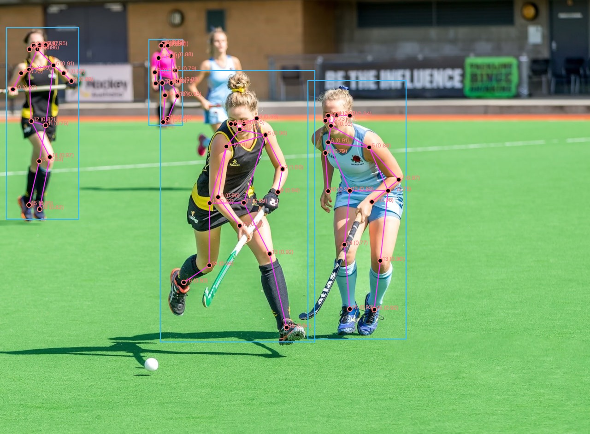
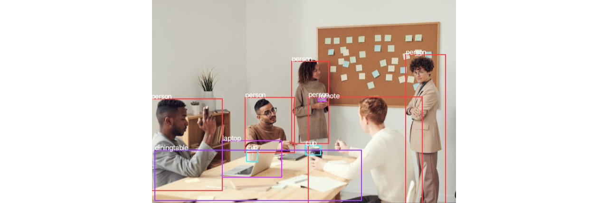

# Deep Vision Processing [](https://github.com/cansik/deep-vision-processing/actions/workflows/build.yml)
Deep computer-vision algorithms for [Processing](https://processing.org/).

The idea behind this library is to provide a simple way to use (inference) machine learning algorithms for computer vision tasks inside Processing. Mainly portability and easy-to-use are the primary goals of this library. Starting with version `0.6.0` CUDA inferencing support is built into the library (Windows & Linux).

_Caution_: The API is still in development and can change at any time.



*Lightweight OpenPose Example*

## Install
It is recommended to use the contribution manager in the Processing app to install the library.


### Manual
Download the [latest](https://github.com/cansik/deep-vision-processing/releases/tag/v0.8.0-alpha) prebuilt version from the [release](https://github.com/cansik/deep-vision-processing/releases) sections and install it into your Processing library folder.

## Usage
The base of the library is the `DeepVision` class. It is used to download the pretrained models and create new networks.

```java
import ch.bildspur.vision.*;
import ch.bildspur.vision.network.*;
import ch.bildspur.vision.result.*;

DeepVision vision = new DeepVision(this);
```

Usually it makes sense to define the network globally for your sketch and create it in setup. The `create` method downloads the pre-trained weights if they are not already existing. The network first has to be created and then be setup.

```java
YOLONetwork network;

void setup() {
  // create the network & download the pre-trained models
  network = vision.createYOLOv3();

  // load the model
  network.setup();
  
  // set network settings (optional)
  network.setConfidenceThreshold(0.2f);
  
  ...
}
```

By default, the weights are stored in the library folder of Processing. If you want to download them to the sketch folder, use the following command:

```java
// download to library folder
vision.storeNetworksGlobal();

// download to sketch/networks
vision.storeNetworksInSketch();
```

Each network has a `run()` method, which takes an image as a parameter and outputs a result. You can just throw in any PImage and the library starts processing it.

```java
PImage myImg = loadImage("hello.jpg");
ResultList<ObjectDetectionResult> detections = network.run(myImg);
```

Please have a look at the specific networks for further information or at the [examples](examples).

### CUDA Support
With version `0.6.0` it is possible to [download the CUDA bundled libraries](https://github.com/cansik/deep-vision-processing/releases/tag/v0.8.0-alpha). This enables to run most of the DNN's on CUDA enabled graphics cards. For most networks this is necessary to run them in real-time. If you have the cuda-bundled version installed and run deep-vision on a Linux or Windows with an NVIDIA graphics card, you are able to enable the CUDA backend:

```java
// Second parameter (enableCUDABackend) enables CUDA
DeepVision vision = new DeepVision(this, true);
```

If the second parameter is unset, the library will check if a CUDA enabled device is available and enables the backend likewise. It is possible to check if CUDA backend has been enabled by the following method:

```java
println("Is CUDA Enabled: " + vision.isCUDABackendEnabled());
```

If CUDA is enabled but the hardware does not support it, Processing will show you a warning and run the networks on the CPU.

## Networks

Here you find a list of implemented networks:

- Object Detection ✨
	- YOLOv3-tiny
	- YOLOv3-tiny-prn
	- EfficientNetB0-YOLOv3
	- YOLOv3 OpenImages Dataset
	- YOLOv3-spp ([spatial pyramid pooling](https://stackoverflow.com/a/55014630/1138326))
	- YOLOv3
	- YOLOv4
	- YOLOv4-tiny
	- [YOLO Fastest & XL](https://github.com/dog-qiuqiu/Yolo-Fastest)
	- SSDMobileNetV2
	- Handtracking based on SSDMobileNetV2
	- TextBoxes
	- Ultra-Light-Fast-Generic-Face-Detector-1MB RFB (~30 FPS on CPU)
	- Ultra-Light-Fast-Generic-Face-Detector-1MB Slim (~40 FPS on CPU)
	- Cascade Classifier
- Object Segmentation
    - Mask R-CNN
- Object Recognition 🚙
    - Tesseract LSTM
- Keypoint Detection 🤾🏻‍♀️
	- Facial Landmark Detection
	- Single Human Pose Detection based on lightweight openpose
- Classification 🐈
    - MNIST CNN
    - FER+ Emotion
    - Age Net
    - Gender Net
- Depth Estimation 🕶
  - MidasNet
- Image Processing
    - Style Transfer
    - Multiple Networks for x2 x3 x4 Superresolution

The following list shows the networks that are on the list to be implemented (⚡️ already in progress):

* YOLO 9K (not supported by OpenCV)
* Multi Human Pose Detection ⚡️ (currently struggling with the partial affinity fields 🤷🏻‍♂️ help?)
* TextBoxes++ ⚡️
* [CRNN](https://github.com/bgshih/crnn) ⚡️
* [PixelLink](https://github.com/ZJULearning/pixel_link)


### Object Detection
Locating one or multiple predefined objects in an image is the task of the object detection networks.



*YOLO Example*

The result of these networks is usually a list of `ObjectDetectionResult`.

```java
ObjectDetectionNetwork net = vision.createYOLOv3();
net.setup();

// detect new objects
ResultList<ObjectDetectionResult> detections = net.run(image);

for (ObjectDetectionResult detection : detections) {
    println(detection.getClassName() + "\t[" + detection.getConfidence() + "]");
}
```

Every object detection result contains the following fields:

* `getClassId()` - id of the class the object belongs to
* `getClassName()` - name of the class the object belongs to
* `getConfidence()` - how confident the network is on this detection
* `getX()` - x position of the bounding box
* `getY()` - y position of the bounding box
* `getWidth()` - width of the bounding box
* `getHeight()` - height of the bounding box

#### YOLO [[Paper](https://pjreddie.com/darknet/yolo/)]
YOLO a very fast and accurate single shot network. The pre-trained model is trained on the 80 classes COCO dataset. There are three different weights & models available in the repository:

- YOLOv3-tiny (very fast, but trading performance for accuracy)
- YOLOv3-spp (original model using [spatial pyramid pooling](https://stackoverflow.com/a/55014630/1138326))
- YOLOv3 (608)
- YOLOv4 (608) (most accurate network)
- YOLOv4-tiny (416)

```java
// setup the network
YOLONetwork net = vision.createYOLOv4();
YOLONetwork net = vision.createYOLOv4Tiny();
YOLONetwork net = vision.createYOLOv3();
YOLONetwork net = vision.createYOLOv3SPP();
YOLONetwork net = vision.createYOLOv3Tiny();

// set confidence threshold
net.setConfidenceThreshold(0.2f);
```

* [Basic Example YOLO](examples/YOLODetectObjects)
* [WebCam Example YOLO](examples/YOLOWebcamExample)
* [RealSense Example YOLO](examples/RealSenseYoloDetector)

#### SSDMobileNetV2 [[Paper](https://arxiv.org/abs/1512.02325)]
This network is a single shot detector based on the mobilenetv2 architecture. It is pre-trained on the 90 classes COCO dataset and is really fast.

```java
SSDMobileNetwork net = vision.createMobileNetV2();
```

* [WebCam Example MobileNet](examples/MobileNetObjectDetectorWebcam)

#### Handtracking [[Project](https://github.com/victordibia/handtracking)]
This is a pre-trained SSD MobilenetV2 network to detect hands.

```java
SSDMobileNetwork net = vision.createHandDetector();
```

* [Hand Detector WebCam Example](examples/HandDetectorWebcam)

#### TextBoxes [[Paper](https://arxiv.org/abs/1611.06779)]
TextBoxes is a scene text detector in the wild based on SSD MobileNet. It is able to detect text in a scene and return its location.

```java
TextBoxesNetwork net = vision.createTextBoxesDetector();
```

#### Ultra-Light-Fast-Generic-Face-Detector [[Project](https://github.com/Linzaer/Ultra-Light-Fast-Generic-Face-Detector-1MB)]
ULFG Face Detector is a very fast CNN based face detector which reaches up to 40 FPS on a MacBook Pro. The face detector comes with four different pre-trained weights:

* RFB640 & RFB320 - More accurate but slower detector
* Slim640 & Slim320 - Less accurate but faster detector
  
```java
ULFGFaceDetectionNetwork net = vision.createULFGFaceDetectorRFB640();
ULFGFaceDetectionNetwork net = vision.createULFGFaceDetectorRFB320();
ULFGFaceDetectionNetwork net = vision.createULFGFaceDetectorSlim640();
ULFGFaceDetectionNetwork net = vision.createULFGFaceDetectorSlim320();
```

The detector detects only the frontal face part and not the complete head. Most algorithms that run on results of face detections need a rectangular detection shape.

* [Face Detector Example](examples/FaceDetectorExample)
* [Face Detector WebCam Example](examples/FaceDetectorCNNWebcam)

#### Cascade Classifier [[Paper](https://citeseerx.ist.psu.edu/viewdoc/summary?doi=10.1.1.110.4868)]
The cascade classifier detector is based on boosting and very common as pre-processor for many classifiers.

```java
CascadeClassifierNetwork net = vision.createCascadeFrontalFace();
```

* [Face Detector Haar Webcam Example](examples/FaceDetectorHaarWebcam)

### Object Recognition
tbd

### KeyPoint Detection
tbd

### Classification
tbd

### Depth Estimation

#### MidasNet

Towards Robust Monocular Depth Estimation: Mixing Datasets for Zero-shot Cross-dataset Transfer


*MidasNet* 

### Image Processing
tbd

## Pipeline
It is possible to create network pipelines to use for example a face-detection network and different classifier for each face. This is not yet documented so you have to check out the test code:
[HumanAttributesPipelineTest.java#L36-L41](https://github.com/cansik/deep-vision-processing/blob/master/src/test/java/ch/bildspur/vision/test/HumanAttributesPipelineTest.java#L36-L41)

## Build
- Install JDK 8 (because of Processing) (JDK 11 for Processing 4)

Run gradle to build a new release package under `/release/deepvision.zip`:

```bash
# windows
gradlew.bat releaseProcessingLib

# mac / unix
./gradlew releaseProcessingLib
```

### Cuda Support
To build with CUDA support enable the property `cuda`:

```bash
gradlew.bat releaseProcessingLib -Pcuda -Pdisable-fatjar
```

*This will take several minutes and result in a `5.3 GB` folder.*
*`disable-fatjar` prevents form creating a fatjar, which would be too big to be zipped.*

### Platform Specific
To build only on a specific platform use the property `javacppPlatform`:

```bash
# builds with support for all platforms
gradlew.bat releaseProcessingLib -PjavacppPlatform=linux-x86_64,macosx-x86_64,macosx-arm64,windows-x86_64,linux-armhf,linux-arm64
```

## FAQ

> Why is xy network not implemented?

Please open an issue if you have a cool network that could be implemented or just contribute a PR.

> Why is it no possible to train my own network?

The idea was to give artist and makers a simple tool to run networks inside of Processing. To train a network needs a lot of specific knowledge about Neural Networks (CNN in specific).

Of course it is possible to train your own YOLO or SSDMobileNet and use the weights with this library. Check out the following example for detection facemasks: 
[cansik/yolo-mask-detection](https://github.com/cansik/yolo-mask-detection)

> Is it compatible with Greg Borensteins [OpenCV for Processing](https://github.com/atduskgreg/opencv-processing)?

No, OpenCV for Processing uses the direct OpenCV Java bindings instead of JavaCV. Please only include either one library, because Processing gets confused if two OpenCV packages are imported.

## About
Maintained by [cansik](https://github.com/cansik) with the help of the following dependencies:

- [bytedeco/javacv](https://github.com/bytedeco/javacv)
- [atduskgreg/opencv-processing](https://github.com/atduskgreg/opencv-processing)

Stock images from the following peoples have been used:

- yoga.jpg by Yogendra Singh from Pexels
- office.jpg by [fauxels](https://www.pexels.com/@fauxels) from Pexels
- faces.png by [shvetsa](https://www.pexels.com/@shvetsa) from Pexels
- hand.jpg by Thought Catalog on Unsplash
- sport.jpg by John Torcasio on Unsplash
- sticker.jpg by 🇨🇭 Claudio Schwarz | @purzlbaum on Unsplash
- children.jpg by [Sandeep Kr Yadav](https://unsplash.com/@fiftymm)
